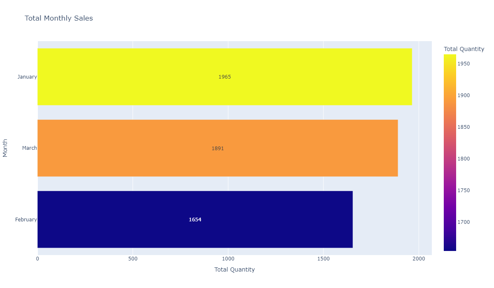
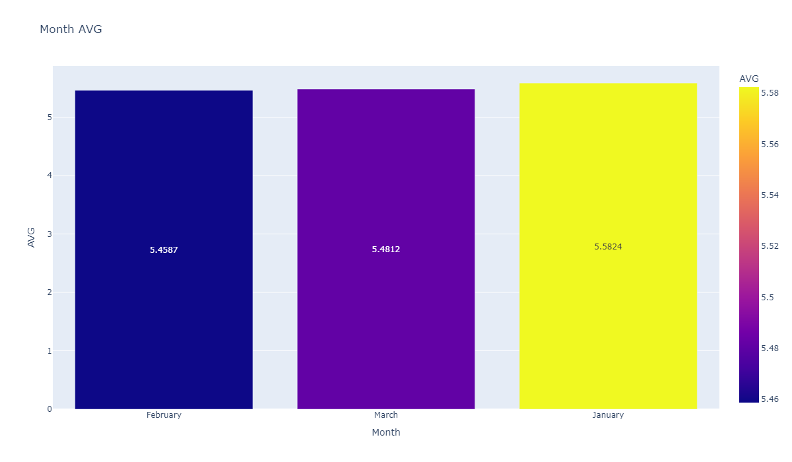
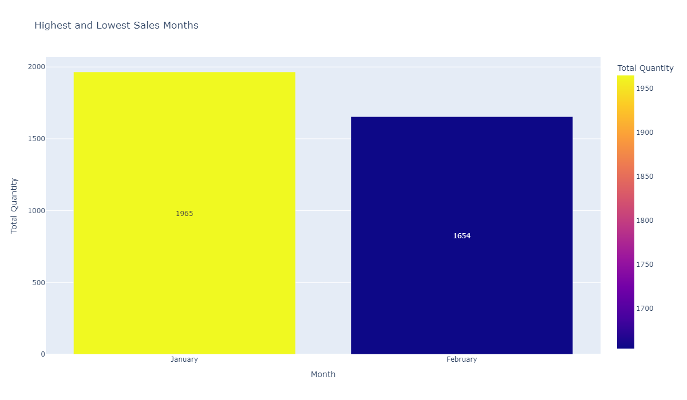
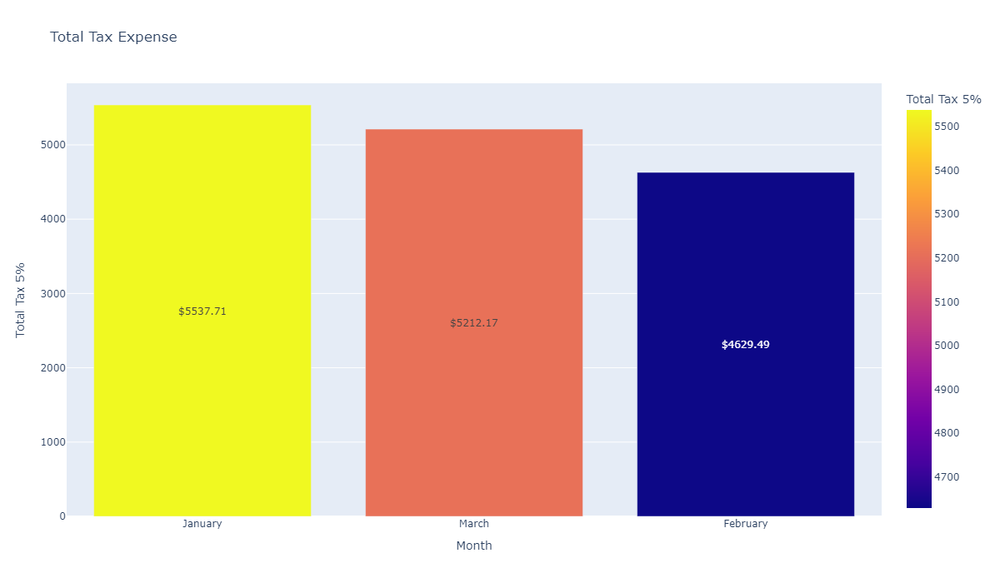
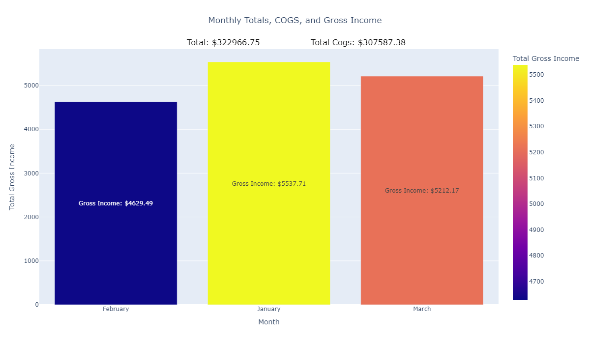
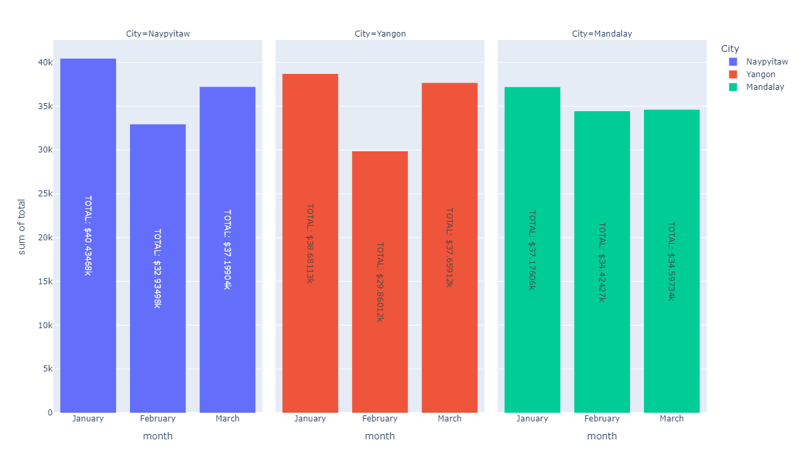
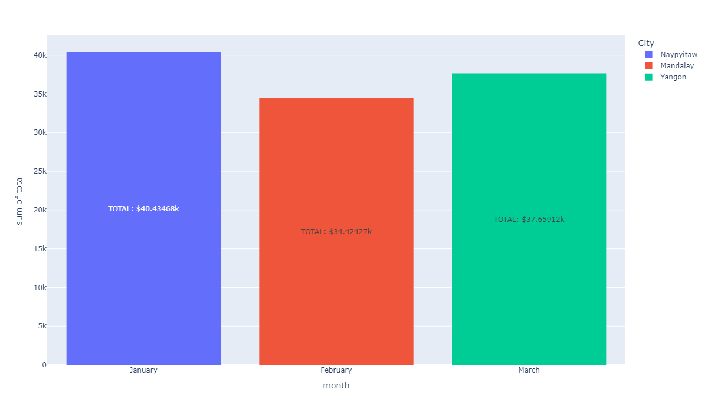
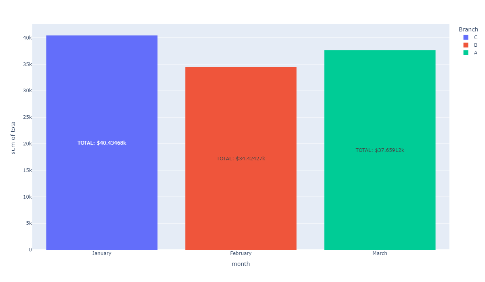

# Monthly Sales Analysis Project

This project analyzes monthly sales data using the **supermarket_sales** dataset, extracting valuable business insights and generating visual summaries in PNG format. The analysis focuses on key metrics like total sales, average sales, tax expenses, and gross profit, providing a clear snapshot of sales performance.

## Dataset

The project uses the **supermarket_sales** dataset, which includes the following columns:

- **Invoice ID**: Unique invoice number for each transaction
- **Branch**: Store branch (A, B, or C)
- **City**: City where the transaction took place
- **Customer type**: Customer type (e.g., Member, Normal)
- **Gender**: Gender of the customer
- **Product line**: Product category
- **Unit price**: Price per unit of product
- **Quantity**: Quantity of product sold
- **Tax 5%**: Tax applied to each sale
- **Total**: Total amount after tax
- **Date**: Date of the transaction
- **Time**: Time of the transaction
- **Payment**: Payment method (e.g., Cash, Credit card, Ewallet)
- **cogs**: Cost of goods sold
- **gross margin percentage**: Gross margin percentage per transaction
- **gross income**: Gross income from each transaction
- **Rating**: Customer rating of the experience

## Sales and Revenue Analysis

The project includes functions to calculate and visualize the following:

- **Total Monthly Sales (`total_monthly_sales()`)**  
  Calculates the total sales for each month.  
  

- **Average Sales Per Month (`month_average_sales()`)**  
  Computes the average monthly sales, helping to understand typical revenue.  
  

- **Highest and Lowest Sales Months (`months_highest_and_lowest()`)**  
  Identifies the months with the highest and lowest sales totals.  
  

- **Total Tax Expense (`total_tax_expense()`)**  
  Summarizes the monthly tax expenses (5%) to track tax costs.  
  

- **Gross Profit Per Month (`gross_profit()`)**  
  Calculates gross profit per month, highlighting profitability trends.  
  

---
## Location and Branch Analysis

- **Performance by branch and city each month**    
  

- **Highest sales by city each month(`cityMonth()`)**  
  
  

- **Highest sales by branch each month (`branchMonth()`)**  
    
  

